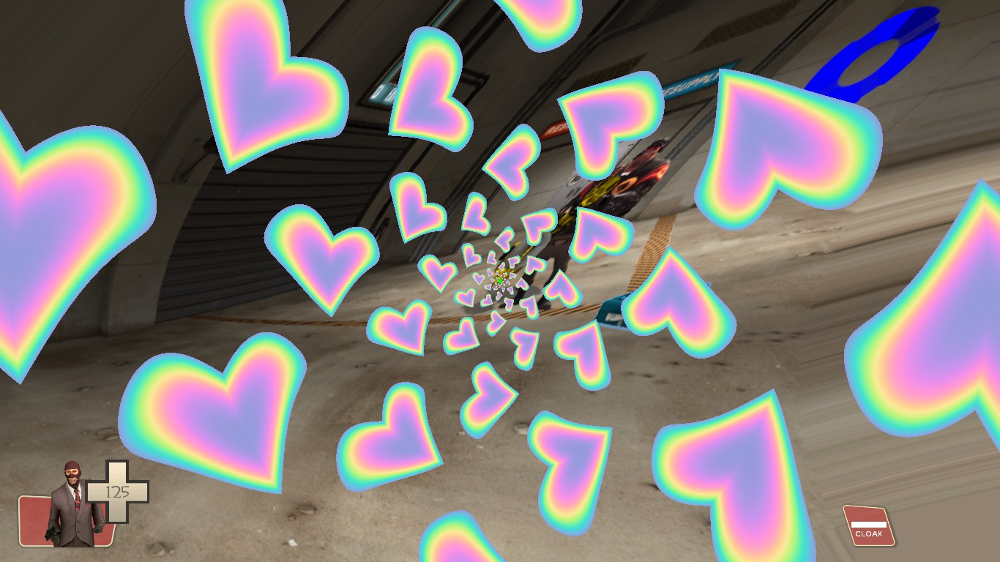

# sdk_screenspace_shaders
SDK that allows you to easily create custom screenspace pixel shaders for Source games.

# Background
It has been discovered that the Source engine supports loading custom pixel shaders, via a completely undocumented shader named `screenspace_general`. The pixel shaders can be applied using a screen overlay.

Such custom shaders can be packed into maps or downloaded by servers, and it works on both Windows and Linux.

This shader happens to work by a complete coincidence. A leftover shader variable for the Orange Box on Xbox 360 (`$x360appchooser 1`) allows color writes to be enabled on the shader, making this possible (normally this shader wouldn't render anything).

This has only been tested on Team Fortress 2, but it should also work for Counter Strike Source, Day of Defeat Source, Half Life 2 Deathmatch and Portal 1.
Left 4 Dead 2 and Portal 2 have an extended version of this shader (which also supports setting a custom vertex shader) but this has not been researched.

# Usage
This repository contains everything required to compile shaders, you do not need to download anything else.

Go into the `shadersrc` folder and run `build_shaders.bat`. This should build the template and example shaders successfully.
The generated shaders are in the `shaders` folder

Create a new folder in your game's `custom` folder such as `my_shaders`.
Copy the `shaders` folder to that new folder, then copy the `materials` folder from this repository to your new folder as well.

Test if the shaders work by loading any map and running this command in console: 
`sv_cheats 1;r_screenoverlay effects/shaders/example_wave`. 
You should see your screen get deformed in a wavy-like pattern.

## Creating a Shader
To create a new shader, copy the `template_ps2x.hlsl` file and rename it to whatever you like.  This example will rename it to `coolshader_ps2x.hlsl` (note: do not change the `_ps2x` suffix).

Add this new shader to the list in `compile_shader_list.txt`.
After you run `build_shaders.bat` again, your new shader should now get compiled.

Next up, you will need to create a VMT for your shader. Go into `materials/effects/shaders/` and copy the `template.vmt`, and rename it to something like `coolshader.vmt`.
Open the VMT and change the $pixshader line to the name of your shader with a `_ps20` suffix, e.g. `coolshader_ps20`.

Your new shader is now setup, and you can apply it to players using two methods:

- `SetScriptOverlayMaterial` (only in TF2 and HL2DM): Fire the `SetScriptOverlayMaterial` input on the !activator with `effects/shaders/coolshader` parameter (or use the equivalent VScript function).
- `r_screenoverlay` : Use a [point_clientcommand](https://developer.valvesoftware.com/wiki/point_clientcommand) and fire the `Command` input with `r_screenoverlay effects/shaders/coolshader` as the parameter on the !activator.

Note: you can stack shaders across two overlays together.

## Modifying the Shader
If you are new to shaders, they are written in a language named HLSL. You can find plenty of guides about this online. This repository comes with multiple example shaders that you can reference. 

The basic overview is that the shader code is run for *every* pixel on the screen. Each shader receives a texture coordinate representing where this pixel is, and it must return the new RGBA color value of the pixel at this position.

[Shadertoy](https://www.shadertoy.com/) is a good website to look for inspiration or see how things are done. Note that these are written in GLSL, a similar language to HLSL with minor differences.

The screenspace pixel shader provided by the engine comes with support for up to 4 textures and 16 customizable float constants. The textures and constants can be modified dynamically in the VMT (see template.vmt), especially with material proxies.

## Reloading the Shader
Unfortunately, the shaders cannot be directly reloaded in-game without restarting the game itself. 

But there is a workaround: you can rename a recompiled shader to something else, change the $pixshader in the VMT to this new name, then type `mat_reloadmaterial <vmt name>` to reload it.

## Packing the Shader
If using these in a map: you will need to manually include the shader files if packing with VIDE or CompilePal, as they will not autodetect the files.

# Limitations
* Custom pixel shaders do not work on DirectX 8. The screen will simply render like normal.
* Source is old and the shaders do not support everything that modern pixel shaders can offer, as the only shader model supported is 2.0b. For example, repeating for-loops don't exist, instead the compiler expands the instructions (which can lead to the instruction limit being hit quickly for large or complex loops).
* The screen will have a slight blur (like FXAA) due to downsampling. If this is an issue, apply the shader overlay only when necessary. UPDATE: this can be workarounded by setting alpha to 0 on untouched pixels (see hearts example)

# Credits
This repository uses a jerryrigged shader setup from [Source SDK 2013](https://github.com/ValveSoftware/source-sdk-2013) and the [standalone shader compiler](https://github.com/SCell555/ShaderCompile) by SCell555. 
Some examples are adapted from [Shadertoy](https://www.shadertoy.com/).